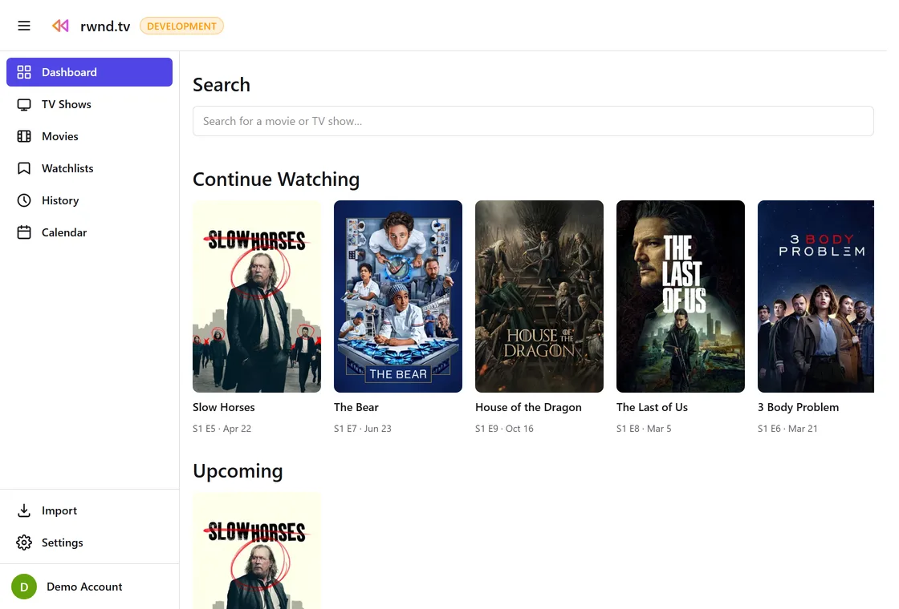
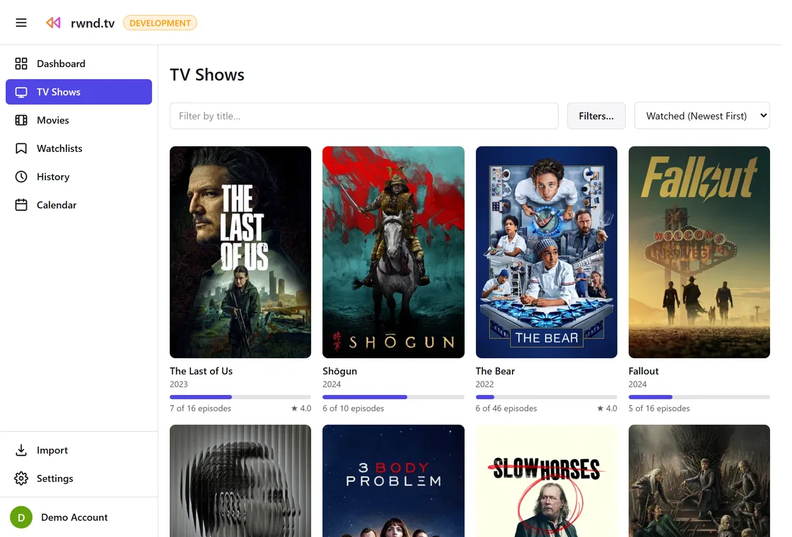
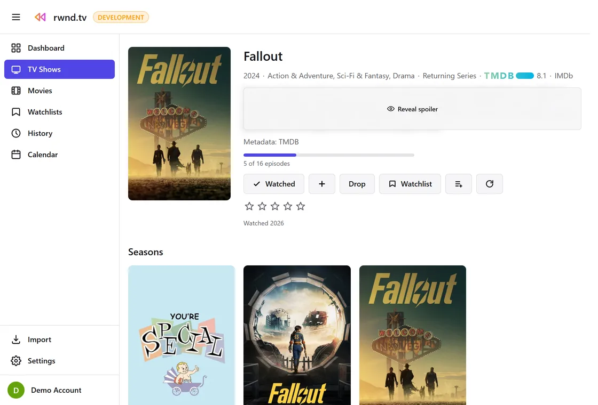
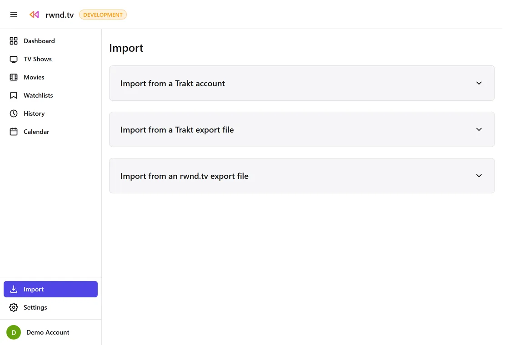

# rwnd.tv

[](https://github.com/rwnd-tv/rwnd.tv/actions/workflows/ci.yml)
[](https://github.com/rwnd-tv/rwnd.tv/actions/workflows/codeql.yml)
[](https://github.com/rwnd-tv/rwnd.tv/actions/workflows/dependabot/dependabot-updates)
[](https://github.com/rwnd-tv/rwnd.tv/actions/workflows/release.yml)
[](LICENSE)

rwnd.tv (rewind dot tv) is an open source, self-hosted app for tracking the TV shows and movies you watch: a replacement for [trakt.tv](https://trakt.tv) that you run yourself.

> **Built with Claude Code.** This project's author isn't a web developer and is building rwnd.tv with Claude Code, in the open, from the start. See [docs/vision.md](docs/vision.md) for the full story and intent.

## Status

**v1.0.9: ready for real use, with M4 underway.** Milestones 1–3 are done: local accounts, search and manual logging, Trakt/CSV import, Plex webhook ingestion, watchlists and ratings, and a full OWASP ASVS 4.0.3 Level 1 security review. M4 has also shipped admin user-management, an owner role, IMDb deep links, and personal webcal/iCal calendar feeds for watch history, upcoming episodes, and movie release dates; broader webhook ingestion (Tautulli/Jellyfin/Emby/Kodi) remains open. See [docs/ROADMAP.md](docs/ROADMAP.md) for the full history and what's next.

## Screenshots

<table>
<tr>
<td align="center">
<picture><source media="(prefers-color-scheme: dark)" srcset="docs/screenshots/dashboard-en-US-dark.webp"></picture>
<br><sub>Dashboard, full size: <a href="docs/screenshots/dashboard-en-US-light.webp">light</a> · <a href="docs/screenshots/dashboard-en-US-dark.webp">dark</a></sub>
</td>
<td align="center">
<picture><source media="(prefers-color-scheme: dark)" srcset="docs/screenshots/shows-en-US-dark.webp"></picture>
<br><sub>TV Shows gallery, full size: <a href="docs/screenshots/shows-en-US-light.webp">light</a> · <a href="docs/screenshots/shows-en-US-dark.webp">dark</a></sub>
</td>
</tr>
<tr>
<td align="center">
<picture><source media="(prefers-color-scheme: dark)" srcset="docs/screenshots/show-detail-en-US-dark.webp"></picture>
<br><sub>Show page, full size: <a href="docs/screenshots/show-detail-en-US-light.webp">light</a> · <a href="docs/screenshots/show-detail-en-US-dark.webp">dark</a></sub>
</td>
<td align="center">
<picture><source media="(prefers-color-scheme: dark)" srcset="docs/screenshots/import-en-US-dark.webp"></picture>
<br><sub>Import, full size: <a href="docs/screenshots/import-en-US-light.webp">light</a> · <a href="docs/screenshots/import-en-US-dark.webp">dark</a></sub>
</td>
</tr>
</table>

## Features

- **Accounts**: local accounts (Argon2id), admin-configurable registration (open / invite / closed), session list & revoke, optional TOTP two-factor authentication, "forgot password" and email verification (self-hosters bring their own SMTP relay)
- **Library**: search movies and TV episodes via TMDB and/or TheTVDB, log watches manually, poster-wall galleries for shows and movies with filters (genre, release year, rating, dropped) and twelve sort orders, per-episode progress, 5-star ratings, any number of named watchlists, and a unified Activity feed of every watch/rating/watchlist change
- **Getting your data in and out**: Trakt import (OAuth device flow or a ZIP export upload, either works with no callback URL or reachable server), CSV import/export round-tripping the same open format, per-user backup/restore independent of a full database dump, and personal webcal/iCal calendar feeds (watch history, upcoming episodes, movie release dates) to subscribe to from Google/Apple/any other compatible calendar app
- **Automation**: Plex webhook ingestion that logs watches as they happen, with first-class multi-user Plex server support (each Plex account linked to its own rwnd.tv user); per-user API tokens back it
- **Instance**: light/dark/system theming, en-GB/en-US locales, a documented HTTP API (OpenAPI 3.1, session-gated Swagger UI at `/api/docs`), and an admin user-management page (a searchable/filterable/sortable list plus a per-user detail page: roles including an owner role immune to demotion, last login, sessions, password reset, account deletion, and bulk actions across several accounts at once)

## Quick start

```sh
curl -O https://raw.githubusercontent.com/rwnd-tv/rwnd.tv/main/docker-compose.yml
curl -O https://raw.githubusercontent.com/rwnd-tv/rwnd.tv/main/.env.example
mv .env.example .env
# edit .env — see docs/self-hosting.md
docker compose up -d
```

Full instructions, configuration reference, and backup/upgrade notes: [docs/self-hosting.md](docs/self-hosting.md).

## Development

Requirements: Node.js ≥ 22, pnpm (`corepack enable`), and a PostgreSQL database to point at.

```sh
pnpm install
cp .env.example apps/api/.env   # fill in DATABASE_URL, TMDB_API_KEY and/or TVDB_API_KEY
# .env.example is written for docker-compose (DATABASE_URL's host is `db`,
# only resolvable inside that network) — point DATABASE_URL at your own
# Postgres instead, and add CORS_ORIGINS=http://localhost:5173 so the Vite
# dev server (5173) can talk to the API (3000) across origins.
pnpm db:migrate
pnpm dev:api    # http://localhost:3000
pnpm dev:web    # http://localhost:5173, proxies /api to the API above
```

Other useful scripts: `pnpm lint`, `pnpm typecheck`, `pnpm test`, `pnpm build`. See [CONTRIBUTING.md](CONTRIBUTING.md) for the full list, including what CI additionally checks.

The project is a pnpm workspace:

| Path                | What                                                                                                                                     |
| ------------------- | ---------------------------------------------------------------------------------------------------------------------------------------- |
| `apps/api`          | Hono JSON API: auth, search, plays, OpenAPI spec at `/api/v1/openapi.json`, Swagger UI at `/api/docs` (both require a signed-in session) |
| `apps/web`          | React (Vite) single-page app                                                                                                             |
| `packages/db`       | Drizzle schema and migrations                                                                                                            |
| `packages/shared`   | Zod schemas and types shared by the API and web app                                                                                      |
| `tools/screenshots` | Playwright tool that captures the screenshots above; its own package, outside the pnpm workspace                                         |
| `docs/`             | Vision doc, roadmap, architecture decision records, self-hosting guide, security review record, and a running TODO log                   |

## Architecture decisions

Significant design choices and their reasoning are recorded in [docs/adr/](docs/adr/):

- [0001](docs/adr/0001-stack.md): TypeScript end-to-end, Hono API + React SPA, Postgres
- [0002](docs/adr/0002-metadata-provider.md): pluggable metadata provider, TMDB first
- [0003](docs/adr/0003-auth-model.md): local accounts with an OIDC-ready credentials table
- [0004](docs/adr/0004-trakt-import.md): Trakt import via OAuth device flow
- [0005](docs/adr/0005-metadata-refresh.md): cached season metadata, with a scheduled refresher
- [0006](docs/adr/0006-multi-provider-metadata.md): multi-provider metadata plumbing
- [0007](docs/adr/0007-security-posture.md): security posture and trust model (M3 review)

## Contributing

Contributions are welcome; see [CONTRIBUTING.md](CONTRIBUTING.md). Please also read the [Code of Conduct](CODE_OF_CONDUCT.md).

## Metadata attribution

 This product uses the TMDB API but is not endorsed or certified by TMDB.

Metadata provided by [TheTVDB](https://www.thetvdb.com/). Please consider adding missing information or subscribing.

## License

[MIT](LICENSE)
